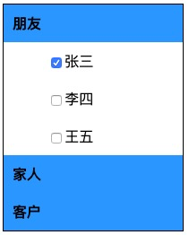
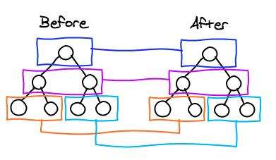

# React.js

[TOC]

## 组件

`web` 组件就是对 `web` 中的数据、结构、方法等进行封装，复用，与 `JavaScript` 中功能函数封装类似，但更关注的是对 `web` 元素（标签）的封装与扩展（扩展：`webComponent`）

`React` 提供了两种组件构建方式

- 函数式组件
- 类式组件

#### 函数式组件

在 <u>React.js</u> 中，定义一个组件的最简单的方式就是 **<u>函数</u>**

```jsx
function Kaikeba() {
    return (
        <div>
            <h2>开课吧!</h2>
        </div>
    );
}
ReactDOM.render(
    <Kaikeba />,
    document.getElementById('app')
);
```

- 函数的名称就是组件的名称
- 函数的返回值就是组件要渲染的内容

> <span style="color:red">函数的名称（组件的名称），必须是首字母大写</span>

#### 类式组件

我们还可以通过 <u>**类（class）**</u>类定义组件

```jsx
class Miaov extends React.Component {
    render() {
        return (
            <div>
                <h2>妙味！</h2>
            </div>
        );
    }
}
```

- 组件类必须继承 <u>**React.Component**</u>
- 组件类必须有 <u>**render**</u> 方法
- <u>**render**</u> 方法的返回值就是组件要渲染的内容

> <span style="color:red">类的名称（组件的名称），也必须是首字母大写</span>


## 不从实际案例开始的知识点就是耍 LM



**样式**

```css
.friend-list {
    border: 1px solid #000000;
    width: 200px;
}
.friend-group dt {
    padding: 10px;
    background-color: rgb(64, 158, 255);
    font-weight: bold;
}
.friend-group dd {
    padding: 10px;
    display: none;
}
.friend-group.expanded dd {
    display: block;
}
.friend-group dd.checked {
    background: green;
}
```

### 创建 <u>FriendList</u> 组件

```jsx
class FriendList extends React.Component {
  	render() {
      	return (
          	<div className="friend-list">
                <div className="friend-group">
                    <dt>家人</dt>
                    <dd>爸爸</dd>
                    <dd>妈妈</dd>
                </div>
                <div className="friend-group">
                    <dt>朋友</dt>
                    <dd>张三</dd>
                    <dd>李四</dd>
                    <dd>王五</dd>
                </div>
                <div className="friend-group">
                    <dt>客户</dt>
                    <dd>阿里</dd>
                    <dd>腾讯</dd>
                    <dd>头条</dd>
                </div>
            </div>
        );
    }
}
```

### 组件复用 - 数据抽取

为了提高组件的复用性，通常会把组件中的一些可变数据提取出来

```js
let datas = {
    family: {
        title: '家人',
        list: [
            {name: '爸爸'},
            {name: '妈妈'}
        ]
    },
    friend: {
        title: '朋友',
        list: [
            {name: '张三'},
            {name: '李四'},
            {name: '王五'}
        ]
    },
    customer: {
        title: '客户',
        list: [
            {name: '阿里'},
            {name: '腾讯'},
            {name: '头条'}
        ]
    }
};
```

### 组件复用 - 数据传入

数据虽然分离了，但是为了降低组件与数据之前的依赖，我们应该尽量避免在组件内部直接访问数据，通过传参的方法来进行解耦

#### property

使用组件的时候通过 <u>标签属性-property</u> 的方式传入数据，在组件内部通过构造函数参数（如果是函数组件，则通过函数参数）来接收传入的数据

```jsx
<组件名称 属性名称="值" />
// 使用表达式
<组件名称 属性名称={表达式} />
```

```jsx
ReactDOM.render(
    <FriendList datas={datas} />,
    document.getElementById('app')
);
```

#### 接收参数 - props

在组件对应的函数或类中通过：

- 函数式组件：通过函数的第一个参数来接收
- 类式组件：通过类的构造函数第一个参数来接收

无论是函数式组件还是类式组件，都会把传入的参数组装成一个对象：

```jsx
<组件名称 属性名称1="值1" 属性名称二={表达式二} />

// 函数式组件
function 组件名称(参数) {
  	// 参数的结构为
  	参数 = {
      	属性名称1: "值1",
      	属性名称二: 表达式二的值
    }
  
	  return <div>组件结构</div>
}
// 类式组件
class 组件名称 extends React.Component {
  	constructor(参数) {
      	super(参数);
      
      	this.props = {
          	属性名称1: "值1"，
          	属性名称2: 表达式二的值
        }
    }
  
  	render() {
      	return <div>组件结构</div>
    }
}
```

在类式组件中，需要注意：

> - 当子类重写 <u>constructor</u> ，则必须调用父类 <u>super</u> - 类的知识点
> - 把接收到的参数传入父类构造函数，父类构造函数中会创建一个对象属性：<u>props</u> 类存储传入的参数数据

#### 通过参数动态渲染组件结构

```jsx
class FriendList extends React.Component {
  	constructor(props) {
      	super(props);
    }
  
  	render() {
      	let {datas} = this.props;
      	return (
          	<div className="friend-list">
            		{Object.keys(datas).map((key, index) => (
                    <div className="friend-group" key={key}>
                        <dt>{datas[key].title}</dt>
                				{datas[key].list.map((list, index) => <dd key={index}>{list}</dd>)}
                    </div>
                ))}
            </div>
        );
    }
}
```

#### 子组件提取

组件与类一样，是一个不断提取的过程，当我们发现某个部分可复用或者结构复杂的时候，我们可以对它再次进行提取

```jsx
class FriendGroup extends React.Component {
		constructor(props) {
				super(props);
    }
  
  	render() {
      	let {data} = this.props;
      	return (
        		<div className="friend-group">
                <dt>{data.title}</dt>
                {data.list.map((list, index) => {
                		<dd key={index}>{list}</dd>
                })}
            </div>
        );
    }
}

class FriendList extends React.Component {
  	constructor(props) {
      	super(props);
    }
  
  	render() {
      	let {datas} = this.props;
      	return (
          	<div className="friend-list">
            		{Object.keys(datas).map((key, index) => (
                    <FriendGroup data={datas[key]} key={key} />
                ))}
            </div>
        );
    }
}
```

### 组件状态

有的时候，一个组件除了可以接收外部传入的数据，还会有属于自己的内部私有数据，同时组件私有数据的更新还会导致组件的重新渲染，比如上面的例子中的每一个好友面板会有一个内部私有数据来控制面板的展开与收缩，我们又把这种数据称为组件状态

#### state

存储组件状态的对象

```jsx
class FriendGroup extends React.Component {
		constructor(props) {
				super(props);
      	this.state = {
          	expanded: false
        };
    }
  
  	render() {
      	let {data} = this.props;
      	let {expanded} = this.state;
      	return (
        		<div className={[
                "friend-group",
                expanded && "expanded"
            ].join(' ')}>
                <dt>{data.title}</dt>
                {data.list.map((list, index) => {
                		<dd key={index}>{list}</dd>
                })}
            </div>
        );
    }
}
```

### 组件交互

一个组件除了有结构、样式，有的时候还会有交互，如上面的例子：现在我们希望当用户点击组件面板 title 的时候，面板组件的展开收缩状态就会发生改变

#### 绑定事件

```jsx
class FriendGroup extends React.Component {
		constructor(props) {
				super(props);
      	this.state = {
          	expanded: false
        };
      	this.expand = this.click.expand();
    }
  
  	expand() {
      	this.setState({
          	expanded: !this.state.expanded
        });
    }
  
  	render() {
      	let {data} = this.props;
      	let {expanded} = this.state;
      	return (
        		<div className={[
                "friend-group",
                expanded && "expanded"
            ].join(' ')}>
                <dt onClick={this.expand}>{data.title}</dt>
                {data.list.map((list, index) => {
                		<dd key={index}>{list}</dd>
                })}
            </div>
        );
    }
}
```

<u>React.js</u> 的事件绑定需要注意：

> - <span style="color:red">事件名称是驼峰命名的</span>
>
> - <span style="color:red">事件绑定函数的 this 指向</span>
>   - <span style="color:red">通过 bind 改变 this 指向，为了能够在方法中调用组件对象的属性和其它方法，我们需要把 this 指向组件</span>
>
>   - <span style="color:red">通过箭头函数处理 this</span>
>

#### 获取事件对象

事件绑定函数的第一个参数是事件对象

#### 原生 DOM 对象

通过事件对象可以获取到原生 DOM 对象

#### 获取原生 DOM 对象

有的时候我们也是需要操作原生 DOM 对象的，除了可以通过事件源来获取，还可以通过 <u>ref</u>  的方式来获取

```jsx
class MyComponent extends React.Component {
  	render() {
      	return (
          	<div>
            		<input ref={el=>this.el=el} />
            		<button onClick={this.todo.bind(this)}>Button</button>
          	</div>
        );
    }
  	todo() {
      	console.log(this.el.value);
    }
}
```

### 状态更新

当我们希望更新组件状态的时候，不要直接修改 <u>state</u> 的值，而是需要调用 <u>setState</u> 方法来进行更新

#### setState 方法

<u>setState</u>  方法由父类 <u>React.Component</u> 提供，当该方法被调用的时候，组件的 <u>state</u> 会被更新，同时会重新调用组件的 <u>render</u> 方法对组件进行渲染

> <span style="color:red">不要直接修改 <u>state</u>，而是调用 <u>setState</u> 方法来更新，组件构造函数是唯一可以对 <u>state</u> 直接赋值（初始化）的位置</span>

```jsx
this.setState({key:val})
```

##### 更新异步

出于性能考虑，<u>setState</u> 方法的修改并不是立即生效的

```jsx
// this.state.val = 0
this.setState({
  	val: this.state.val + 1
});
// this.state.val 的值并不是 1
console.log(this.state.val);
```

##### 更新合并

<u>React</u> 会把多个 <u>setState</u> 合并成一个调用

```jsx
// this.state.val = 0
this.setState({
  	val: this.state.val + 1
});
this.setState({	// 因为异步的问题，this.state.val 的值在这里还是0
  	val: this.state.val + 1
});
```

```jsx
Object.assign(
  previousState,
  {val: state.val + 1},
  {val: state.val + 1},
  ...
)
```

##### 回调函数

如果，有多个 <u>setState</u> 的调用，后一次的修改如果需要依赖上一次修改的值，那么可以使用函数的方式

```jsx
// this.state.val = 0
this.setState((state, props) => {
  	return {val: state.val + 1}
});
this.setState((state, props) => {
  	return {val: state.val + 1}
});
```

### props 与 state 的区别

<u>state</u> 的主要作用是用于组件保存、控制、修改*自己*的可变状态，在组件内部进行初始化，也可以在组件内部进行修改，但是组件外部不能修改组件的 <u>state</u>

<u>props</u> 的主要作用是让使用该组件的父组件可以传入参数来配置该组件，它是外部传进来的配置参数，组件内部无法控制也无法修改

<u>state</u> 和 <u>props</u> 都可以决定组件的外观和显示状态。通常，<u>props</u> 做为不变数据或者初始化数据传递给组件，可变状态使用 <u>state</u>

> 能使用 <u>props</u> 就不要使用 <u>state</u>

#### 无状态组件

没有 <u>state</u> 的组件，我们称为无状态组件，因为状态会带来复杂性，所以，通常我们推荐使用无状态组件，也鼓励编写无状态组建

#### 函数式组件

函数式组件没有 <u>state</u> ，所以通常我们编写使用函数式组件来编写无状态组件

### 组件通信与数据流

在上面的案例中，我们实现了一个多选式的好友列表（每个独立的面板都有自己独立的状态，互不影响）。下面我们再来看另外一种情况：单选式的好友列表（多组列表同时只能有一个为展开状态，也就是多个面板之间的状态是互相影响的）

#### 状态提升

通过分析可以发现，面板的展开状态不在是组件内部私有状态了，多个组件都会受到这个状态的影响，也就是它们共享了一个状态。为了能够让多个不同组件共享同一个状态，这个时候，我们把这个状态进行提升，交给这些组件最近的公共父组件进行管理

```jsx
class FriendGroup extends React.Component {
		constructor(props) {
				super(props);
      
      	this.changeExpand = this.changeExpand.bind(this);
    }
  
  	changeExpand() {
      	typeof this.props.onExpand === 'function' && 			this.props.onExpand(this.props.index);
    }
  
  	render() {
      	let {data, expandedIndex, index} = this.props;
      	return (
        		<div onClick={this.changeExpand} className={[
                "friend-group",
                expandedIndex === index && "expanded"
            ].join(' ')}>
                <dt>{data.title}</dt>
                {data.list.map((list, index) => {
                		<dd key={index}>{list}</dd>
                })}
            </div>
        );
    }
}

class FriendList extends React.Component {
  	constructor(props) {
      	super(props);
      
      	this.state = {
          	expandedIndex: 0
        }
      
      	this.changeExpandedIndex = this.changeExpandedIndex.bind(this);
    }
  
  	changeExpandedIndex(expandedIndex) {
        this.setState({
            expandedIndex
        });
    }
  
  	render() {
      	let {datas} = this.props;
      	return (
          	<div onExpand={this.changeExpandedIndex} className="friend-list">
            		{Object.keys(datas).map((key, index) => (
                    <FriendGroup data={datas[key]} index={index} expandedIndex={expandedIndex} key={key} />
                ))}
            </div>
        );
    }
}
```

#### 数据流

在 <u>React.js</u> 中，数据是从上自下流动（传递）的，也就是一个父组件可以把它的 <u>state / props</u> 通过 <u>props</u> 传递给它的子组件，但是子组件不能修改 <u>props</u> - <u>React.js 是单向数据流</u>，如果子组件需要修改父组件状态（数据），是通过回调函数方式来完成的。

##### props 函数

父组件在调用子组件的时候，传入一个函数类型的 <u>props</u>

```jsx
<FriendGroup data={datas[key]} index={index} expandedIndex={expandedIndex} key={key} />
```

在子组件中根据具体的处理逻辑，调用父组件通过 <u>props</u> 传入的对应函数，类似 <u>on 事件</u> 的机制，同时子组件可以在调用回调函数的时候，传入一些数据

##### 更新父组件

在父组件的代码中，通过 <u>setState</u> 重新渲染父组件，父组件的更新会重新渲染子组件


## key

憋说话，看我！

```jsx
class MyComponent extends React.Component {

    constructor(props) {
        super(props);
        
        this.state = {
            arr: ['html', 'css', 'javascript']
        }
        this.sort = this.sort.bind(this);
    }

    sort() {
        this.setState({
            arr: this.state.arr.sort( _ => Math.random() - .5 )
        });
    }

    render() {
        let {arr} = this.state;
        return(
            <div>
                <ul>
                    {arr.map( (v, k) => (
                        <li>
                            <input type="checkbox"/>
                            <span>{v}</span>
                        </li>
                    ) )}
                </ul>
                <button onClick={this.sort}>乱序</button>
            </div>
        );
    }
}

ReactDOM.render(
    <MyComponent />,
    document.getElementById('app')
);
```

> 通过控制台查看结构变化

### 渲染优化

1. 用JS对象模拟DOM树 : <u>Virtual DOM</u>
2. 通过 <u>DOM 操作</u> 把 <u>Virtual DOM</u> 生成真实的 <u>DOM</u>
3. 后期的更新，会比较 新老 <u>Virtual DOM</u> ，通过 <u>diff</u> 算法优化更新操作

#### Virtual DOM

原生 <u>DOM</u> 对象结构太复杂，同时存在许多情况下用不到的一些特性

<u>Virtual DOM</u> 本质上与 原生 <u>DOM</u> 没有区别，都是 <u>JavaScript</u> 对象，只是它的结构更加简洁

#### <u>Diffing</u> 算法

<u>React.js</u> 不只是模拟了一个 <u>DOM</u>，同时在针对 <u>DOM</u> 进行渲染的时候




